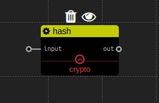

加密服务
================
## base64加密

### 描述

提供简单的base64加密服务

### 配置

### 输入

‘input’： 字符串， 被加密的数据。

### 输出

‘out’： 字符串， 加密后的结果。

### 例子

## hash加密

### 描述

hash加密是通过md5和sha256哈希函数加密的

### 配置

‘method’： 字符串， 想要使用的哈希函数， 值为‘md5’或者‘sha256’中的一种。

### 输入

‘input’： 字符串， 被哈希加密的数据。

###　输出

‘out’：　字符串，　被哈希加密后的结果。

###　例子

