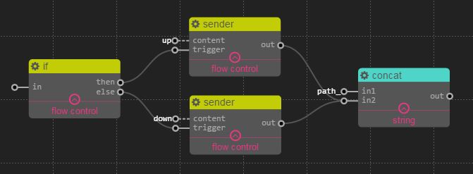
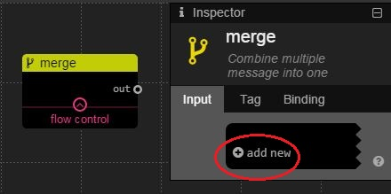

flow
================
## gate

### Description

This service is a controllable gate for dataflow.

### Inport

`gate`: Boolean. *Non-trigger* inport, the state of gate.

`in`: Any.

### Outport

`out`: Any. Output the value of `in` if `gate` is true.

### Example

For this example, the value of `gate` was fixed to false, no data output forever.

## if

### Description

This service is a splitter for dataflow, `then` outputs true when `in` is true, otherwise `else` outputs true.

**Note that**: Only one outport outputs true each time.

### Inport

`in`: Boolean.

### Outport

`then`: Boolean. Output true only when `in` is true

`else`: Boolean. Output true only when `in` is false

### Example

For this example, if `in` is true, the upper branch will be satisfied and eventually output "path_up",
otherwise the lower branch will be selected and eventually output "path_down".

## sender

### Description

Output the value of `content` to `out` only when `trigger` received message.

### Inport

`content`: Any. *Non-trigger* inport

`trigger`: Any. The value will be discard.

### Outport

`out`: Any.

### Example

## merge

### Description

This service combines all inport to a JSON object and output it.

### Inport

You can add/delete inport, and the name of inport is changable.

### Outport

`out`: JSON Object. keys from the name of inports and value from each inport.

### Example

For this example, the value of `out` is {"name":"abc", "phone":12345, "addr":"intel corp"}