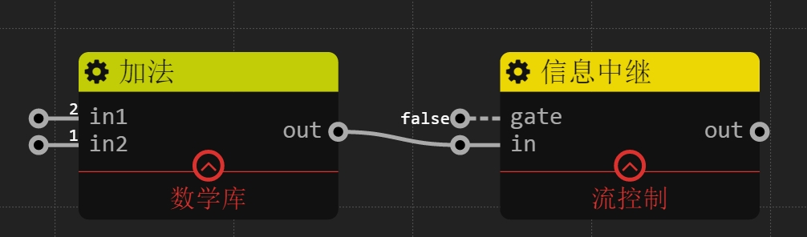
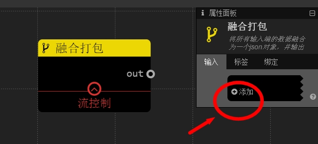

流控制
================
## 信息中继

### 描述

控制该数据通路的开关。如果`gate`是true，那么输出等于输入。如果`gate`是false，该通路关闭，没有输出。

### 输入

`gate`: 布尔值 非触发信号，该信息通路的阀门

`in`: 任意类型

### 输出

`out`: 任意类型 如果`gate`是true, 那么`out` = `in`

### 样例

图中`gate`为false,所以信息中继的`out`将不会有任何输出

## if

### 描述

如果`in`输入为true，则`then`输出true，否则`else`端口输出true". 类似于消息的分路器

### 输入

`in`: 布尔值 

### 输出

`then`: 布尔值 当`in`为true时,输出true,反之不输出

`else`: 布尔值 当`in`为false时,输出true,反之不输出

### 样例

图中if的`in`如果是true,那么会走上面的分支,最终输出"path_up". 如果是false,会走下面的分支,输出"path_down"

## 数据发送

### 描述

每当触发信号`trigger`到来时,输出`content`的内容

### 输入

`content`: 任意类型 非触发信号

`trigger`: 任意类型

### 输出

`out`: 任意类型

### 样例

每当`trigger`有输入,不管输入是什么内容,都发送`content`的值

## 除法

### 描述

将所有输入端的数据融合为一个json对象，并输出

### 输入

用户手动添加端口,端口名可以编辑

### 输出

`out`: JSON对象 键名就是输入引脚名,键值就是输入引脚的值

### 样例

输出JSON对象是 {"name":"abc", "phone":12345, "addr":"intel corp"}