mysql service
================

#Description
To use this builtin service, you need to install mysql 
on your computer, and set your mysql configuration 
properly. For mysql builtin service, you need to type
host,port,your mysql username, your mysql password 
intocorresponding configuration line, and then type SQL
statement into input line.

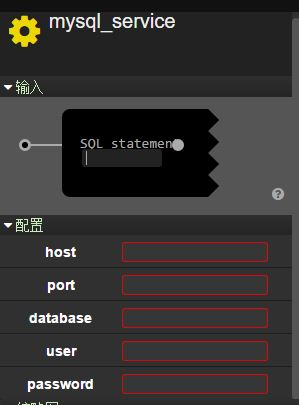

#SQL_Statement

## insert

### Description

insert data 

### Configuration

`host`: String.

`port`: int.

`database`: String.

`user`: String.

`password`: String.

### Inport

`SQL_statement`: String.

### Outport

`result`: String.

`info`: String.

### Example

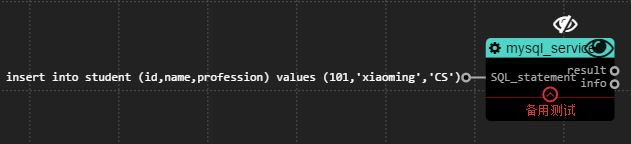

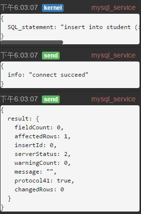

`host`: host.

`port`: port.

`database`: mysql database.

`user`: mysql username.

`password`: mysql password.

`SQL_statement`:insert into student (id,name,profession) values (101,'xiaoming','CS')

`result`: result.

`info`: 'connect succeed'

`function`: insert (id:10,name:xiaoming,profession:CS)
into table student.

## delete

### Description

delete record

### Configuration

`host`: String.

`port`: int.

`database`: String.

`user`: String.

`password`: String.

### Inport

`SQL_statement`: String.

### Outport

`result`: String.

`info`: String.

### Example

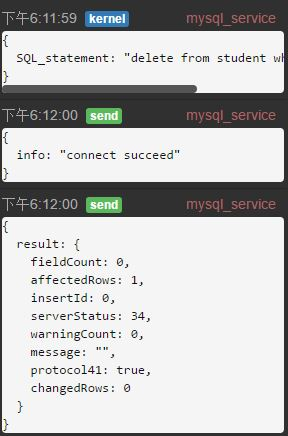

`host`: host.

`port`: port.

`database`: mysql database.

`user`: mysql username.

`password`: mysql password.

`SQL_statement`: delete from student where name='lihua'

`result`: result.

`info`: 'connect succeed'.

`function`: delete record whose name is lihua from table
student.

## update

### Description

update data

### Configuration

`host`: String.

`port`: int.

`database`: String.

`user`: String.

`password`: String.

### Inport

`SQL_statement`: String.

### Outport

`result`: String.

`info`: String.

### Example

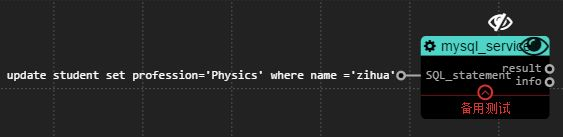

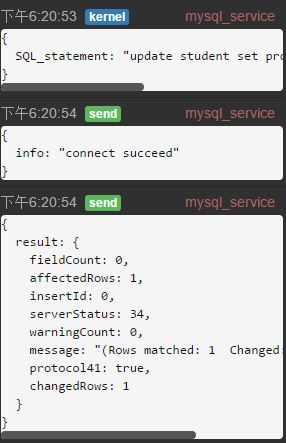

`host`: host.

`port`: port.

`database`: mysql database.

`user`: mysql username.

`password`: mysql password.

`SQL_statement`: update student set profession='Physics' where name ='zihua'

`result`: result

`info`: 'connect succeed'.

`function`: Change student zihua's profession into Physics.

## query

### Description

query data

### Configuration

`host`: String.

`port`: int.

`database`: String.

`user`: String.

`password`: String.

### Inport

`SQL_statement`: String.

### Outport

`result`: String.

`info`: String.

### Example

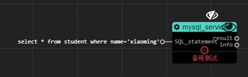

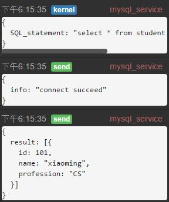

`host`: host.

`port`: port.

`database`: mysql database.

`user`: mysql username.

`password`: mysql password.

`SQL_statement`: select * from student where name='xiaoming'

`result`: result.

`info`: `connect succeed`

`function`: Query all information of record whose name is xiaoming from table student.

## create table

### Description

create table

### Configuration

`host`: String.

`port`: int.

`database`: String.

`user`: String.

`password`: String.

### Inport

`SQL_statement`: String.

### Outport

`result`: String.

`info`: String.

### Example

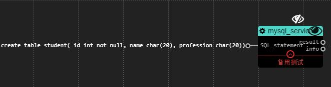

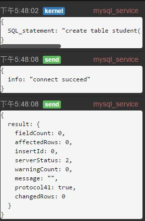

`host`: host.

`port`: port.

`database`: mysql database.

`user`: mysql username.

`password`: mysql password.

`SQL_statement`: create table student( id int not null, name char(20), profession char(20)).

`result`: result.

`info`: 'connect succeed'

`function`: Create table student which has three field(id,name,profession) in choosen database. 

## drop table

### Description

drop table

### Configuration

`host`: String.

`port`: int.

`database`: String.

`user`: String.

`password`: String.

### Inport

`SQL_statement`: String.

### Outport

`result`: String.

`info`: String.

### Example

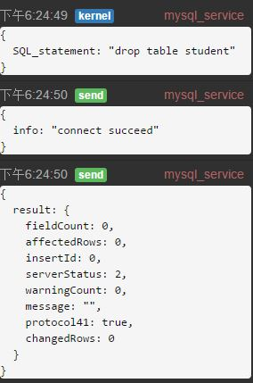

`host`: host.

`port`: port.

`database`: mysql database.

`user`: mysql username.

`password`: mysql password.

`SQL_statement`: drop table student.

`result`: result.

`info`: 'connect succeed'.

`function`: drop table student in choosen database.
