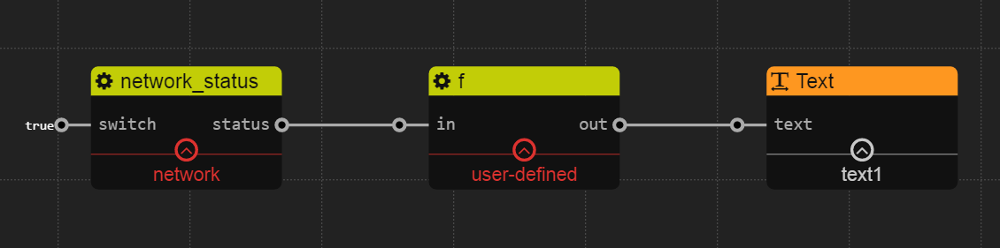

network
===========

## http_request

### Description

This servide provides ability for send http request.

It is implemented by [Request](https://www.npmjs.com/package/request).

### Config

`url`: String. Http request url. If the url does not start with *http://*, it will be added with *http://*.

`method`: String. Request method. Now only `get`,`post`,`put`,delete`,`patch` are supported.

`headers`: Object. Request headers. Default is *{}*.

`body`: Object. Request body. Default is *{}*.

`proxy`: String. Optional. You can set the proxy manually.

`timeout`: Number. Request timeout. Default is *50000*(50s).

### Inport

`switch`: Boolean. The switching signal of http request. If it's true, this service will send request and format response data. 

### Outport

`out`: String. The http reuquest result including `statusCode`,`headers`,`body`


### Example


In this example, we send request to http://www.baidu.com and write the response body to file.

</br>

### Output Format

```javascript
{
    "statusCode": 200,
    "headers": "response.headers",
    "body": "response.body"
}
```

##network_status

### Description

This service provides ability for getting localhost IPv4 network status.

### Inport

`switch`: Boolean. The switching signal of network status. If it's true, this service will get localhost IPv4 network status.

### Outport

`status`: Object. The network status. If there is no external IPv4 network is available, the format of status is `null`.
### Example



In this example, we show the IP of localhost with `Text` widget.

function code
```javascript
if(in!=null){
	return in.address;
}
```
</br>

### Output Format

```javascript 
null or {
    		address: '10.10.7.138',
   	 		netmask: '255.255.240.0',
    		family: 'IPv4',
    		mac: '30:5a:3a:bd:fb:cc',
    		internal: false
		}
```

## tcp_request

### Description

This servide provides ability for send tcp request.

### Config

`ip`: String. Server ip.

`port`: Number. Server port.


### Inport

`switch`: Boolean. The switching signal of tcp request. If it's true, this service will send request and format response data. 

`data`: String. The message send to server.

### Outport

`out`: String. Data response from server.


### Example


In this example, every 3 second, we send request to 127.0.0.1:9999 and show response data with `Text` widget.

</br>

## tcp_server

### Description

This servide provides ability for create a simple tcp server.

### Config

`ip`: String. Listening ip. Default is *0.0.0.0*

`port`: Number. Listening port.

`f(data)`: Function. Deal with the data from cilent.

### Inport

`switch`: Boolean. The switching signal of tcp server. If it's true, this server will be alive otherwise the server will be closed.


### Example


In this example, we create a tcp server listening on 0.0.0.0:9999. When cilent send data, we simply append "hello" to it.

function code
```javascript
return data.toString() + "hello";
```

</br>

## udp_request

### Description

This servide provides ability for send udp request.

### Config

`ip`: String. Server ip.

`port`: Number. Server port.


### Inport

`switch`: Boolean. The switching signal of udp request. If it's true, this service will send request and format response data. 

`data`: String. The message send to server.

### Outport

`out`: String. Data response from server.


### Example

See tcp request example. 

</br>

## udp_server

### Description

This servide provides ability for create a simple udp server.

### Config

`ip`: String. Listening ip. Default is *0.0.0.0*

`port`: Number. Listening port.

`f(data)`: Function. Deal with the data from cilent.

### Inport

`switch`: Boolean. The switching signal of udp server. If it's true, this server will be alive otherwise the server will be closed.


### Example

See tcp server example. 
