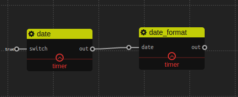

Timer
================

## date

### Description

This service will output current date.

### Inport

`switch`: Boolean. The switching signal of date. 

### Outport

`out`: Date. Current date object.

### Output Format
```javascript
2016-08-05T02:54:16.462Z
```

## date_format 

### Description

This service receive a date object and output date information according to specific format.

### Inport

`date`: Date. Input date object. If date is not an instance of Date, it will using current Date.

### Outport

`out`: String. Format result.

### Example



This example generate date object using `date` service and output information in format of *yyyy-MM-dd hh:mm:ss*
`out`: 2016-08-05 11:02:40


## delay

### Description

Whenever `in` receives a value, the value will be pass to `out` after `delay` milliseconds.

### Inport

`delay`: Integer. Default is 1000, *Non-trigger* inport. The time delay.

`in`: Any.

### Outport

`out`: Any. The value from `in` after delay.

### Example


For this example, if the add operation finished, 3 will be output after 1 second delay.


## interval

### Description

This service can be used as event source, which periodically output 1 to `out`.

### Inport

`in`: Integer. Default is 1000. The period of time.

### Outport

`out`: Integer. At this stage, the output value is fixed to Integer 1

### Example


After each 1 second, `out` will output a "hello" string.


## timestamp 

### Description

This service receive a date object and output according timestamp.

### Inport

`date`: Date. Input date object. If date is not an instance of Date, it will using current Date.

### Outport

`out`: String. Timestamp.

### Example


This example generate date object using `date` service and output `timestamp`
`out`: 1470366406291
