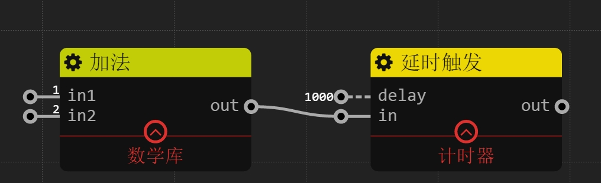
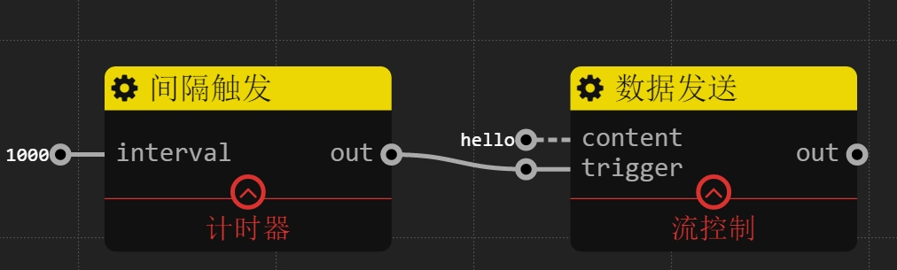

计时器
================
## 延时触发

### 描述

每当`in`端口有信息到来,延时`delay`ms后再发送

### 输入

`delay`: 整数 默认值1000 非触发信号，设置延时。

`in`: 任意类型

### 输出

`out`: 任意类型 延时输出`in`的内容

### 样例

图中加法完成后，会延时1秒再输出结果3

## 间隔触发

### 描述

每间隔`interval``ms,`out`就会输出1

### 输入

`in`: 整数 默认值1000 设置间隔时间 

### 输出

`out`: 整数 每间隔`interval``ms,输出1

### 样例

每经过1s，都会输出“hello”