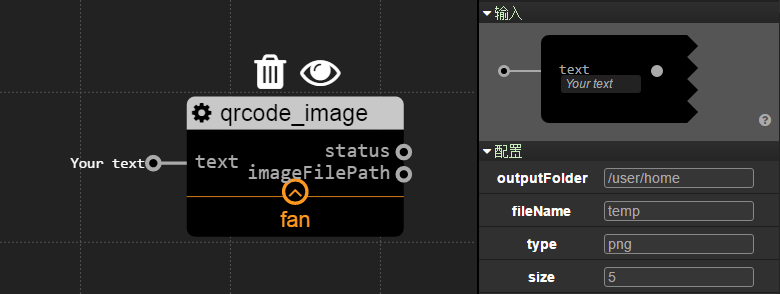

util
================
## qrcode_image

### Description

This service provides ability to create a qrcode image file according to the inprot `text`.

At this page, only supports absolute file path.

### Config

`outputFolder`: String. The folder that you want to export the qrcode image file,if the directory is non-existent,it will create it automatically.

`fileName`: String. The name of qrcode image file.

`type`: String. The format of qrcode image file,possible values are `png`(default), `svg`, `eps` and `pdf`.

`size`: Int.  The Size of one module in pixels. Default 5 for png and svg.But this config is useless for eps and pdf.

### Inport

`text`: String. The text content that you want to transform into qrcode image file.

### Outport

`status`: Boolean. The status signal of export qrcode image file. If it's true, this service has completed the operation.

`imageFilePath`: String. The final file path of qrcode image file,if the output `status` exports false,this output exports nothing.

### Example

