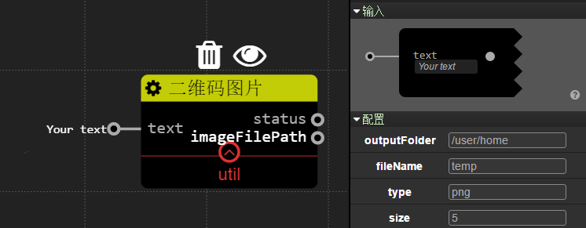

工具
================
## 二维码图片

### 描述

服务能根据输入的文本生成二维码图片文件。

本服务仅仅支持绝对路径读取文件。

### 配置

`outputFolder`: 字符串类型。 你想输出二维码图片文件的目录，如果目录不存在则会被自动创建。

`fileName`: 字符串类型。 二维码图片文件的名字。

`type`: 字符串类型。二维码图片文件的格式，可选的值为：`png`(默认), `svg`, `eps` 和 `pdf`。

`size`: 整数类型。 一个二维码图片模块的像素大小.对于png和svg的默认值为5。但是这个配置对eps和pdf没有作用。

### 输入

`text`: 字符串类型。 你想转化成二维码图片文件的文本内容。

### 输出

`status`: 布尔类型. 输出二维码图片文件的状态信号. 如果是true, 那么服务就已经完成此次操作。

`imageFilePath`: 字符串类型。 二维码图片文件的最终文路径,如果出口`status`输出false,那么这个出口什么也不输出。

### 例子

