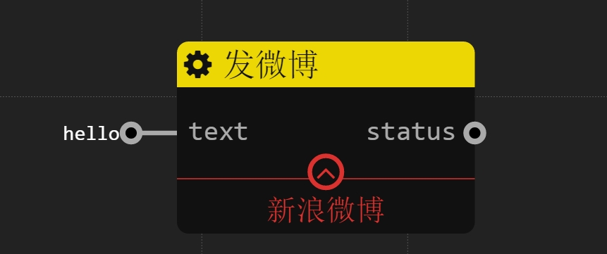

新浪微博
================
## 发微博

### 描述

发送微博

内部通过[node-weibo-twitter](https://www.npmjs.com/package/node-weibo-twitter)实现

现阶段仅支持发文字微博,并不支持网络代理

### 配置

`token`: 字符串 必填项 微博账户的access token

### 输入

`text`: 字符串 微博内容

### 输出

`status`: 布尔值 如果发送成功,输出true,反之输出false

### 样例

发送了内容为hello的微博。微博的账号和发送设备都是通过token决定的。