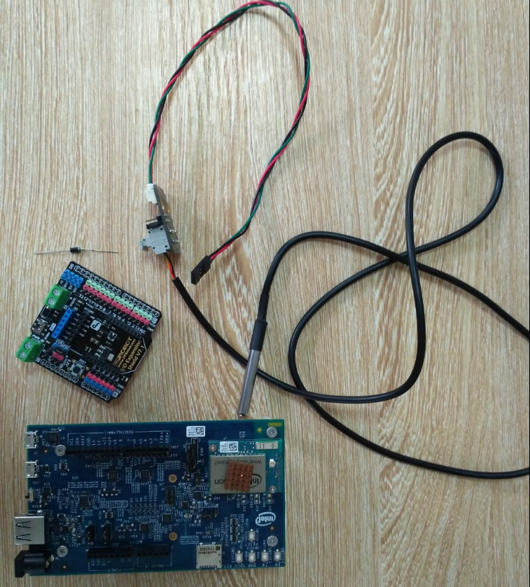
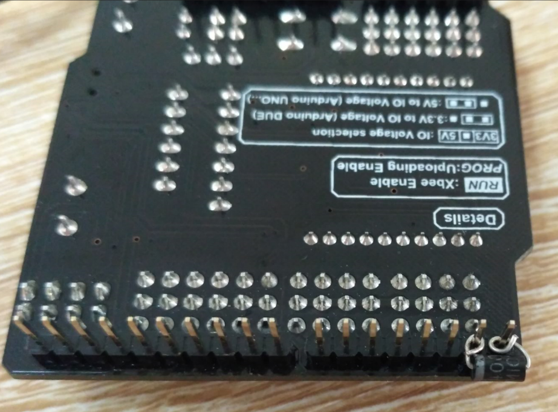
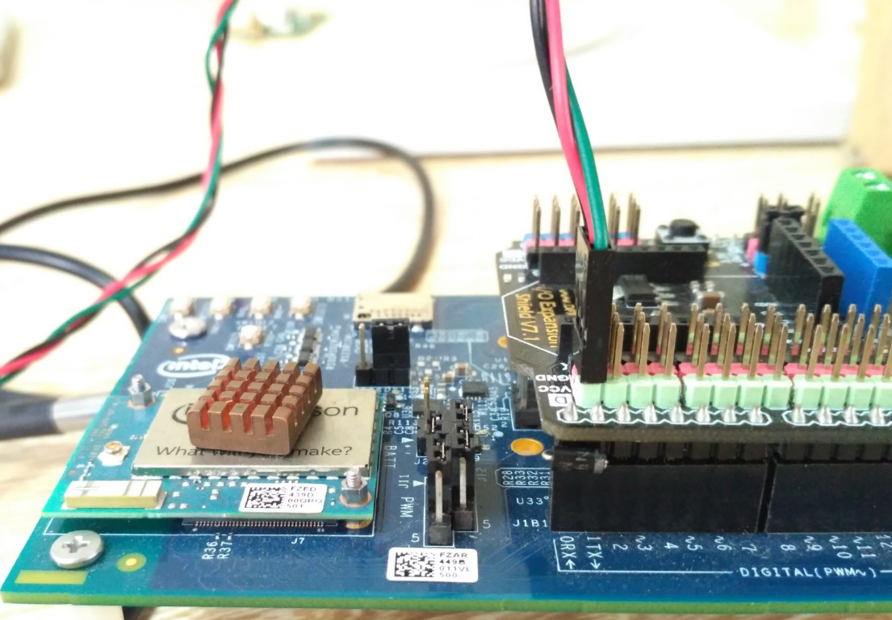

# DS18B20
---
##Description
---
This service can be used to get temperature from digital temperature DS18B20.User just need to connect signal port of DS18B20 and 0RX port of Edison when useing.
And you need to flow https://github.com/intel-iot-devkit/mraa/pull/415 to connect 0RX and 0TX of Edison by a diode.

####Input
`trigger`:number

####Output
`temp`:number

