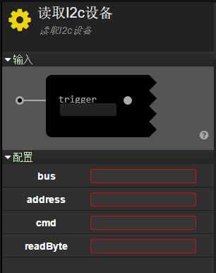
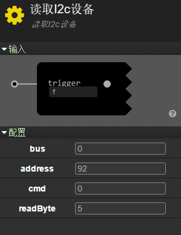
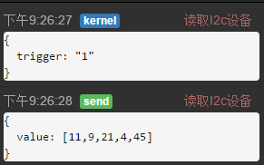

# I2c
---
##Description
---
This service can be used to get messages from devices via I2c protocol.When using it,user need to input the I2c bus to use,the I2c address of the device,the command to send  and the length of the return data in the Configuration line.

##Sample
---
###The use of DHT12 Temperature&Humidity Sensor
---
####Description
reading temperature and humidity from DHT12

####Input
`trigger`:number

####Config
`bus`:number
`address`:number
`cmd`:number
`readByte`:number

####Output
`value`:array

####Example

