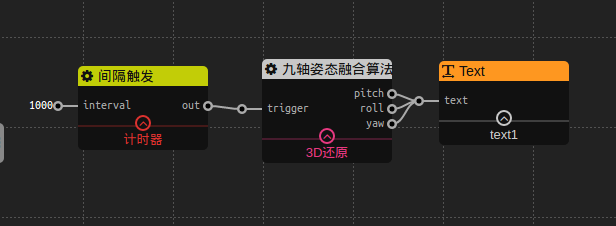

9 Axis Attitude Fusion Algorithm
================
### Description
Calculate the euler angles by mpu9150.



Notice: this service depend on `jsupm_mpu9150` module, you should install it first by the following command:

````shell
npm install jsupm_mpu9150 -g
````

### Config

`dt`: a `number` represents sample frequency.
`K`: a `number` represents accelerometer weight.

### Inport
`trigger`: trigger signal.

### Outport
`pitch`: a `number` represents output pitch.
`roll`: a `number` represents output roll.
`yaw`: a `number` represents output yaw.
