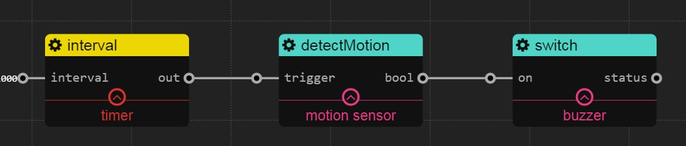

Motion Sensor
======
## detectMotion

### Description

detect whether people moves according to the change of IR value

### Config

`pin`: int. The gpio pin which is attached by the sensor

### Input

`trigger`: any type. It is a trigger signal, and whenever it comes, the service will detect motion

### Output

`bool`: boolean. true means people moves (IR value changes) in the last 3s

### Example

It will detect whether people moves in every 1s, if people moves, the buzzer starts buzzing, otherwise, the buzzer stop buzzing.