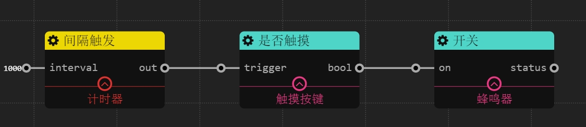

触摸按键
======
## 是否触摸

### 描述

有输入时，该按键是否处于被触摸，如果是，输出true，反之输出false

### 配置

`pin`: 整数. 该按键连接的GPIO引脚. 必填项

### 输入

`trigger`: 任何类型. 触发信号, 每来一次输入做一次是否触摸的判断

### 输出

`bool`: 布尔值. true表示按键被触摸, false表示没有

### 样例

图中每隔1s就查询按钮状态,如果被触摸就打开蜂鸣器,反之则关闭